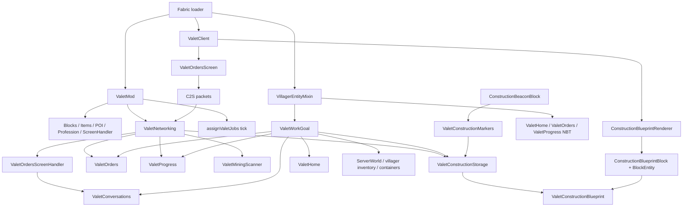

# Audit complet du mod Valet

Date: 2026-06-19  
Portee lue: `src/main/java`, `src/main/resources`, mixins, assets, manifests.  
Verification initiale: `.\gradlew.bat build -x installClientJar` passait apres autorisation reseau du wrapper Gradle.
Verification post-corrections: `.\gradlew.bat build` passe apres chaque correction appliquee et installe le jar client via `installClientJar`.
Le depot local n'a aucun commit, donc l'historique recent vient de la memoire durable et de l'etat courant du code.

## 1. Inventaire source

### Java

| Fichier | Role | API publique | Entrantes | Sortantes / etat possede |
|---|---|---|---|---|
| `src/main/java/com/wawane/valet/ValetMod.java` | Entrypoint Fabric, registres blocs/items/POI/profession/screen handler, events d'ouverture GUI et tick d'assignation metier. | `ValetMod`, constantes publiques, `id(String)`, `onInitialize()` | `fabric.mod.json`, `ValetClient`, `ValetNetworking`, ressources assets/data | Registres Fabric/Minecraft, `UseEntityCallback`, `ServerTickEvents`, `ItemGroupEvents`; possede les singletons de blocs/items/profession/screen handler. |
| `src/main/java/com/wawane/valet/ValetNetworking.java` | Packets C2S, ouverture GUI, validation serveur des ordres/perks/renommage, generation d'items blueprint. | `registerServerReceivers()`, `openValetOrders(...)`, packet IDs | `ValetMod`, `ValetOrdersScreen` | `ValetOrders`, `ValetProgress`, `ValetMiningScanner`, `ValetConstructionStorage`, `ValetConversations`; possede les IDs packet. |
| `src/main/java/com/wawane/valet/ValetHome.java` | Origine de travail du valet, fallback NBT quand le job-site vanilla disparait. | `get`, `set`, `writeToNbt`, `readFromNbt` | `ValetWorkGoal`, `ValetMiningScanner`, `VillagerEntityMixin` | Map statique `HOMES<UUID, BlockPos>`, brain memory `JOB_SITE`, NBT `ValetHomeX/Y/Z`. |
| `src/main/java/com/wawane/valet/ValetConversations.java` | Compteur d'ecrans ouverts par valet pour figer le deplacement pendant dialogue. | `begin`, `end`, `isTalking` | `ValetNetworking`, `ValetOrdersScreenHandler`, `ValetWorkGoal` | Map statique `OPEN_SCREENS<UUID, Integer>`. |
| `src/main/java/com/wawane/valet/ai/ValetWorkGoal.java` | Goal principal et dispatch de state machine IA: availability, path execution, helpers de reach/path/inventory partages. | constructeur, `canStart`, `shouldContinue`, `start`, `stop`, `tick` | `VillagerEntityMixin` | Delegue runtime a `MiningRuntimeTask`, `ConstructionRuntimeTask`, `LogisticsRuntimeTask`; possede encore `State`, `PathPurpose`, `path`, navigation step target. |
| `src/main/java/com/wawane/valet/client/ValetClient.java` | Entrypoint client: ecran GUI et renderer blueprint. | `onInitializeClient()` | `fabric.mod.json` client entrypoint | `HandledScreens`, `BlockEntityRendererRegistry`. |
| `src/main/java/com/wawane/valet/client/ConstructionBlueprintRenderer.java` | Rendu client des blocs manquants d'un blueprint pose. | constructeur, `render`, `rendersOutsideBoundingBox` | `ValetClient` | `ConstructionBlueprintBlockEntity`, `ValetConstructionBlueprint`, monde client. |
| `src/main/java/com/wawane/valet/construction/ConstructionBeaconBlock.java` | Bloc marqueur de copie de construction. | constructeur, `onPlaced` | `ValetMod` | `ValetConstructionMarkers.placeMarker`. |
| `src/main/java/com/wawane/valet/construction/ConstructionBlueprintBlock.java` | Bloc placeable contenant un blueprint et une orientation. | constructeur, `createBlockEntity`, `getRenderType`, `getPlacementState`, `onPlaced`, `onBreak` | `ValetMod` | `ConstructionBlueprintBlockEntity`, NBT item/block, drop manuel. |
| `src/main/java/com/wawane/valet/construction/ConstructionBlueprintBlockEntity.java` | Block entity blueprint: id, nom, blueprint complet, sync client. | constructeur, getters, `setConstruction`, `setFromStackNbt`, `readNbt`, `toInitialChunkDataNbt`, `toUpdatePacket` | `ValetMod`, `ConstructionBlueprintBlock`, renderer | NBT `ConstructionId`, `ConstructionName`, `Blueprint`; `ValetConstructionBlueprint`. |
| `src/main/java/com/wawane/valet/construction/ConstructionBlueprintItem.java` | Item du blueprint avec nom/tooltip NBT. | constructeur, `getName`, `appendTooltip` | `ValetMod`, `ValetNetworking`, `ConstructionBlueprintBlock` | Lit NBT item. |
| `src/main/java/com/wawane/valet/construction/ValetConstructionBlueprint.java` | Modele serialisable d'une construction. | constructeur, accessors, `blockCount`, `writeNbt`, `readNbt`, record `Entry` | storage, marker, block entity, renderer, goal | Liste immuable triee d'entrees; serialise `BlockState`. |
| `src/main/java/com/wawane/valet/construction/ValetConstructionMarkers.java` | Deux balises posables par joueur pour copier une structure. | `placeMarker` | `ConstructionBeaconBlock` | Map statique `FIRST_MARKERS<UUID, Marker>`, `ValetConstructionStorage`. |
| `src/main/java/com/wawane/valet/construction/ValetConstructionStorage.java` | `PersistentState` par monde pour blueprints sauvegardes. | `get`, `addBlueprint`, `getBlueprint`, `getSummaries`, `nextDefaultName`, `writeNbt` | markers, networking, goal | `blueprints`, `nextId`, NBT `NextId/Blueprints`. |
| `src/main/java/com/wawane/valet/construction/ValetConstructionSummary.java` | DTO compact pour sync GUI des constructions. | record, `fromBlueprint`, `write`, `read` | storage, networking, handler, screen | `PacketByteBuf`. |
| `src/main/java/com/wawane/valet/gui/ValetOrdersScreenHandler.java` | Payload serveur/client du screen, fermeture conversation, validation distance. | constructeurs, getters, `canUse`, `quickMove`, `onClosed` | `ValetMod`, `ValetNetworking`, client screen | Lit `PacketByteBuf`, appelle `ValetConversations.end`. |
| `src/main/java/com/wawane/valet/gui/ValetOrdersScreen.java` | GUI client: liste d'ordres, arbre de perks, rename, envoi packets. | constructeur, `render`, `mouseClicked`, `keyPressed`, `close`, `removed` | `ValetClient`, handler | `ClientPlayNetworking`, etat local optimiste ordre/perk/nom. |
| `src/main/java/com/wawane/valet/mixin/VillagerEntityMixin.java` | Injection dans tous les villagers: ajoute goal, lit/ecrit NBT Valet. | mixin uniquement | `valet.mixins.json` | `ValetWorkGoal`, `ValetHome`, `ValetOrders`, `ValetProgress`. |
| `src/main/java/com/wawane/valet/order/ValetOrder.java` | Enum des ordres affichables/persistables. | enum, `getTranslationKey`, `fromIndex` | orders, GUI, networking, goal | Clefs lang. |
| `src/main/java/com/wawane/valet/order/ValetOrders.java` | Etat ordre cible par villager + NBT. | `get`, `set`, getters/setters cibles, `writeToNbt`, `readFromNbt` | networking, handler, goal, mixin | Maps statiques UUID: ordre, cible minerai/bois/construction. |
| `src/main/java/com/wawane/valet/order/ValetMineTarget.java` | Enum minerais cibles par tag vanilla. | enum, `getTranslationKey`, `matches`, `fromIndex` | scanner, GUI, networking, orders, goal | Tags `BlockTags.*_ORES`. |
| `src/main/java/com/wawane/valet/order/ValetMiningScanner.java` | Scan des ressources autour du poste/valet pour le GUI. | `countNearbyOres`, `countNearbyWood` | networking | `ValetHome`, monde. |
| `src/main/java/com/wawane/valet/order/ValetWoodTarget.java` | Enum bois cibles par blocs logs/wood/stems. | enum, `getTranslationKey`, `matches`, `fromIndex` | scanner, GUI, networking, orders, goal | Blocs vanilla. |
| `src/main/java/com/wawane/valet/progress/ValetPerk.java` | Enum perks, clefs NBT/lang, icones UI. | enum, getters, `fromIndex` | progress, GUI, networking, goal | Clefs lang et NBT. |
| `src/main/java/com/wawane/valet/progress/ValetProgress.java` | XP, niveau, points de perks, perks possedes + NBT. | getters, `hasPerk`, `getPerks`, `addXp`, `choosePerk`, `writeToNbt`, `readFromNbt` | networking, GUI payload, goal, mixin | Map statique `DATA<UUID, Data>`, NBT progression. |

### Ressources, mixins, assets

| Fichier | Role | Entrantes | Sortantes / remarques |
|---|---|---|---|
| `src/main/resources/fabric.mod.json` | Manifest Fabric. | Fabric loader | Main `ValetMod`, client `ValetClient`, mixin `valet.mixins.json`. |
| `src/main/resources/valet.mixins.json` | Config mixin. | Fabric/Mixin | Charge `VillagerEntityMixin`, `defaultRequire:1`. |
| `src/main/resources/data/minecraft/tags/point_of_interest_type/acquirable_job_site.json` | Rend le POI valet acquisible par villagers. | Vanilla POI/job-site | Reference `valet:valet_workstation`. |
| `src/main/resources/data/minecraft/tags/blocks/mineable/axe.json` | Tag outil pour workstation. | Minecraft tags | Reference seulement `valet:valet_workstation`. |
| `src/main/resources/data/valet/recipes/valet_workstation.json` | Recette workstation. | Datapack recettes | Produit `valet:valet_workstation`. |
| `src/main/resources/data/valet/recipes/construction_beacon.json` | Recette beacon. | Datapack recettes | Produit 2 `valet:construction_beacon`. |
| `src/main/resources/assets/valet/lang/en_us.json` | Lang US. | GUI/messages/items | 89 cles, complet vs FR. |
| `src/main/resources/assets/valet/lang/fr_fr.json` | Lang FR. | GUI/messages/items | Meme jeu de cles que EN. |
| `src/main/resources/assets/valet/blockstates/*.json` | Blockstates des 3 blocs. | Model loader | Blueprint gere 4 facings, sans rotation de modele. |
| `src/main/resources/assets/valet/models/block/*.json` | Modeles blocs cube_all. | Blockstates | Textures vanilla: spruce/yellow/light blue concrete. |
| `src/main/resources/assets/valet/models/item/*.json` | Modeles items. | Item model loader | Parent vers modeles blocs. |
| `src/main/resources/assets/valet/textures/entity/villager/profession/valet.png` | Texture profession villager. | Villager renderer | Asset binaire inspecte: petit overlay profession. |
| `src/main/resources/assets/valet/textures/entity/villager/profession/valet.png.mcmeta` | Metadata texture villager. | Villager renderer | `"hat": "none"`. |

Fichiers absents importants:
- Aucun `src/main/resources/data/valet/loot_tables/blocks/*.json`.
- Aucun test automatise.

## 2. Carte d'architecture

### Proprietaires d'etat

- Registres globaux: `ValetMod`.
- Etat ordre par villager: `ValetOrders` via maps statiques UUID + NBT.
- Etat XP/perks par villager: `ValetProgress` via map statique UUID + NBT.
- Etat origine de travail: `ValetHome` via map statique UUID + NBT + brain `JOB_SITE`.
- Etat conversation ouverte: `ValetConversations` via map statique UUID uniquement.
- Etat IA runtime: champs de chaque `ValetWorkGoal`.
- Etat constructions globales: `ValetConstructionStorage` via `PersistentState`.
- Etat premiere balise par joueur: `ValetConstructionMarkers` via map statique UUID uniquement.
- Etat GUI client: `ValetOrdersScreen` local, reconstruit a l'ouverture, non resynchronise apres packet.

## 3. Bugs critiques / importants

### B1 - Les blocs custom ne drop probablement pas eux-memes

- Fichiers: `src/main/java/com/wawane/valet/ValetMod.java:55`, `:67`, `:79`; ressources absentes `data/valet/loot_tables/blocks`.
- Impact: `valet_workstation` et `construction_beacon` sont craftables mais peuvent etre perdus en les cassant. `construction_blueprint` ne droppe que via code manuel si son `constructionId >= 0`.
- Cause: bloc custom sans loot table JSON ni logique drop equivalente.
- Fix: ajouter `data/valet/loot_tables/blocks/valet_workstation.json`, `construction_beacon.json`, eventuellement `construction_blueprint.json` pour cas vide, ou gerer explicitement `afterBreak`.

### B2 - Glowing permanent / cleanup absent

- Fichiers: `ValetNetworking.java:66-67`, `ValetOrdersScreen.java:440-467`.
- Impact: ouvrir le GUI met `setGlowing(true)` cote serveur et l'ecran client ne sait jamais eteindre: `highlightValet(false)` retourne immediatement. Le status effect dure 30 minutes et le flag manuel peut rester jusqu'a correction externe.
- Fix: supprimer `villager.setGlowing(true)` et garder seulement l'effet temporaire, ou stocker/restaurer l'etat initial. Corriger `highlightValet(false)` pour remettre `setGlowing(false)` cote client si l'effet visuel local est voulu.

### B3 - Maps statiques UUID non purgees et NBT progression ecrit sur tous les villagers

- Fichiers: `VillagerEntityMixin.java:28-39`, `ValetProgress.java:15`, `:69-87`, `:93-95`, `ValetOrders.java:15-18`, `ValetHome.java:19`, `ValetConversations.java:10`, `ValetConstructionMarkers.java:22`.
- Impact: fuite memoire progressive sur serveurs longs, et `ValetProgress.writeToNbt` cree une entree `Data` puis ecrit `ValetLevel/ValetXp/ValetPendingPerks` pour chaque villager, meme non valet.
- Fix: ne lire/ecrire Valet que si le villager est valet ou si les cles Valet existent deja. Ajouter une API `clear(UUID)` appelee sur mort/unload/world stop, ou remplacer les maps statiques par un composant/persistent data attache a l'entite.

### B4 - Blueprints serialisent les `BlockState` par raw ID instable

- Fichier: `ValetConstructionBlueprint.java:74`, `:86`.
- Impact: un blueprint sauve peut reconstruire des blocs faux apres changement de version, modlist ou ordre de registry. C'est dangereux pour les constructions sauvegardees en `PersistentState` et dans les items.
- Fix: serialiser les block states par identifiants/proprietes stables (`NbtHelper.fromBlockState` / `toBlockState` avec registry lookup, ou codec Minecraft), avec champ `DataVersion`.

### B5 - Liste d'ordres GUI sans scroll, overflow garanti

- Fichier: `ValetOrdersScreen.java:221-249`, `:391-393`.
- Impact: avec tous les minerais disponibles: `none + categorie + 8 minerais + categorie bois + categorie construction = 12 lignes`, plus que la hauteur utile. Les bois et constructions aggravent le cas. Des lignes sortent du panneau/ecran et deviennent difficiles ou impossibles a utiliser.
- Fix: ajouter scroll/clipping pour `orderEntries`, ou des onglets/categories avec panneau cible separe.

### B6 - Etat client optimiste sans ack serveur

- Fichiers: `ValetOrdersScreen.java:469-506`, `ValetNetworking.java:164-183`, `:197-199`, `:245-248`.
- Impact: le client marque ordre/perk comme choisi avant validation serveur. Si la ressource disparait, si le joueur est trop loin, ou si un perk est refuse, l'ecran affiche un etat faux jusqu'a fermeture/reouverture.
- Fix: envoyer une reponse S2C de state refresh apres chaque mutation, ou ne modifier le local qu'apres ack serveur.

### B7 - Comparaison de dimension avec `==`

- Fichier: `ValetMod.java:175-176`.
- Impact: `RegistryKey` doit etre compare avec `.equals`. `==` peut laisser croire qu'un poste n'est pas reclame si l'objet cle n'est pas la meme instance.
- Fix: `pos.getDimension().equals(world.getRegistryKey())`.

### B8 - Fermeture conversation fragile si l'entite n'est plus trouvable

- Fichiers: `ValetNetworking.java:71`, `ValetOrdersScreenHandler.java:148-151`.
- Impact: `begin` est par UUID villager, mais `end` depend d'un lookup entity par id au close. Si le villager unload/meurt/change de dimension avant fermeture, `OPEN_SCREENS` garde un compteur.
- Fix: stocker UUID + dimension dans le handler, et finir la conversation par UUID meme si l'entite n'est plus chargee.

### B9 - Construction remplace/pose avec `FORCE_STATE`

- Fichier: `ValetWorkGoal.java:1461-1462`.
- Impact: `Block.FORCE_STATE` contourne une partie des validations/updates de placement. Risque pour blocs a logique de placement, voisins, eau, orientation, blocks moddes.
- Fix: utiliser les chemins de placement normaux quand possible, ou encapsuler par type de bloc special. Garder `FORCE_STATE` seulement pour restauration de blueprint explicitement assumee.

## 4. Bugs logiques et incoherences mineures

- `ValetOrder.FARM` et `ValetOrder.DEPOSIT` existent mais ne sont ni affiches ni executes: `ValetOrder.java:5`, `:9`, `ValetNetworking.java:154-219`, `ValetWorkGoal.java:186-198`. Les supprimer ou implementer.
- `ValetOrders.set(villager, order)` ne nettoie les cibles que pour `NONE`: `ValetOrders.java:27-35`. Si un ordre non cible est restaure, des cibles stale peuvent rester en maps.
- Cles lang mortes: `screen.valet.perk_available`, `message.valet.no_ore`, `order.valet.farm`, `order.valet.deposit`.
- `ValetNetworking.openValetOrders` scanne minerais/bois deux fois a l'ouverture: `ValetNetworking.java:80-86` et `:105-107`. Cacher les tableaux dans la factory.
- `ValetConstructionStorage` n'a ni suppression, ni renommage, ni limite de blueprints: les packets GUI grossissent sans borne (`ValetNetworking.java:146-151`).
- `ValetConstructionMarkers.FIRST_MARKERS` ne purge pas les joueurs deconnectes: `ValetConstructionMarkers.java:22-37`.
- `ValetHome` persiste X/Y/Z sans dimension: `ValetHome.java:16-18`, `:47-57`. Le brain memory garde la dimension, le fallback NBT non.
- `ValetWorkGoal.depositInventory` ignore l'inventaire combine des double chests: `ValetWorkGoal.java:1624-1652`. Pour les double coffres, utiliser l'API chest combinee.
- `tickDepositing` peut deposer dans des coffres autour du poste sans marcher vers chacun: `ValetWorkGoal.java:707-710`, `:1655-1673`. C'est pratique mais incoherent avec le pathfinding.
- Le pathfinding de `ValetWorkGoal` teleporte le villager de case en case via `refreshPositionAndAngles`: `ValetWorkGoal.java:572-576`. Ca evite l'IA vanilla mais contourne collisions/portes/navigation.
- `ValetConstructionMarkers.copyStructure` arrete la copie au premier layer vide: `ValetConstructionMarkers.java:54-64`. Les structures avec etage vide/floating roof sont tronquees.
- `ConstructionBlueprintBlock.onBreak` ne droppe un blueprint que si `constructionId >= 0`: `ConstructionBlueprintBlock.java:52-61`. Si un blueprint vide est obtenu plus tard, il sera perdu.
- Pas de tests unitaires ou integration pour NBT, packets, state machine, ou serialization blueprint.

## 5. NBT / Codec / versioning

- `ValetOrders`: lit/ecrit enum par `name()`. Migration possible si les noms changent; ajouter version ou noms stables.
- `ValetProgress`: pas de version, pas de cleanup, defaults corrects pour level/xp/perks, mais ecrit aussi sur non-valets.
- `ValetHome`: defaults corrects, mais pas de dimension.
- `ValetConstructionStorage`: `NextId` corrige via max des ids lus, bon point.
- `ValetConstructionBlueprint`: probleme majeur raw ID; ajouter `DataVersion` et format stable.
- `ConstructionBlueprintBlockEntity`: sync initiale et update packet presents, bon point. `setConstruction` markDirty mais ne force pas update client immediate; acceptable si set on placement/chunk data, a renforcer si mutation live.

## 6. Timing Fabric / client-server

- Registrations principales sont au chargement statique de `ValetMod`, OK pour Fabric 1.20.1.
- `ValetNetworking.registerServerReceivers()` est appele dans `onInitialize`, OK.
- `HandledScreens.register` et renderer sont cote client uniquement, OK.
- `UseEntityCallback` ouvre uniquement sur main hand et valet, OK.
- `ServerTickEvents.END_WORLD_TICK` scanne les villagers proches des joueurs toutes les 40 ticks. Fonctionne, mais c'est un contournement partiel de l'acquisition vanilla du POI.
- Le mixin ajoute `ValetWorkGoal` a tous les villagers au constructeur, puis `canStart` filtre les non-valets. Fonctionne mais ajoute un goal inutile a tous les villagers.

## 7. Auto-review des changements recents

- Extraction `ValetNetworking.java`: appliquee. `ValetMod.java` est moins charge (`UseEntityCallback` et `registerServerReceivers` delegues). Reste a separer `ValetNetworking` en DTO/handlers/open-screen car il gere encore packets, payload GUI, glow, give item.
- UI arbre de perks: appliquee dans `ValetOrdersScreen.java:124-189`, clic direct dans `:418-424`. Regression: optimistic local state sans ack + overflow liste.
- Rename: applique via `RENAME_PACKET_ID` et `renameValet`: `ValetNetworking.java:44`, `:252-272`; client: `ValetOrdersScreen.java:508-518`.
- `STORAGE`: applique correctement cote gameplay: `ValetProgress` sync les perks et `ValetWorkGoal.getUsableInventorySlots` passe de 4 a 8: `ValetWorkGoal.java:1824-1830`.
- Retour au poste: applique par `RETURNING_HOME`, `ValetHome.get`, `idleAtWorkstation`: `ValetWorkGoal.java:173-175`, `:480-532`.
- Freeze dialogue: applique par `ValetConversations.isTalking` dans `canStart/shouldContinue/tick`: `ValetWorkGoal.java:120-126`, `:154-157`, `:1807-1810`. Risque restant: compteur non purge.
- Torches passables mais non standables: applique. `isPassableTunnelSpace` accepte torches, `canStandOn` les refuse implicitement: `ValetWorkGoal.java:997-1006`.
- Vein continuity: applique via `veinTargets`, `selectNextVeinOre`, `pruneCurrentVein`, `removeFromCurrentVein`: `ValetWorkGoal.java:263-276`, `:1082-1107`.
- Depot/retour coffre: mieux separe (`RETURNING`, `DEPOSITING`, `RETURNING_HOME`), mais depot multi-coffres a distance et double chest incomplet restent a corriger.

## 8. Architecture long terme

L'architecture actuelle tient pour prototype jouable. Le principal risque initial etait `ValetWorkGoal.java`: 1913 lignes mesurees avant refactor, 1057 lignes apres extractions runtime et correction du deplacement. La decomposition est desormais quasi finie; le risque restant est surtout la validation en jeu.

Decoupage concret propose avant nouvelles features:

- `ai/ValetWorkGoal.java`: garder uniquement integration `Goal`, `canStart`, `tick`, delegation a une state machine.
- `ai/ValetStateMachine.java`: enum state, transitions, interruptions, delais.
- `ai/path/ValetPathPlanner.java`: A*, bounds, stand goals, passability, obstruction mining.
- `ai/tasks/MiningTask.java`: minerais, filons, drops, torches.
- `ai/tasks/WoodcuttingTask.java`: clusters bois, drops.
- `ai/tasks/ConstructionTask.java`: selection site, build targets, double blocks.
- `ai/inventory/ValetInventoryTransfer.java`: stockage, depot, double chests, simulation insert.
- `state/ValetData.java`: ordre + progression + home dans un modele unique.
- `network/packets/*`: DTO packet, validation serveur, S2C state refresh.
- `gui/ValetOrdersViewModel.java`: snapshot immutable lu par screen/handler.
- `construction/BlockStateCodec.java`: serialization stable des block states.

Ce qu'un mod Fabric propre ferait a cette echelle:

- Packets separes par intention, handlers courts, serveur autoritaire + ack S2C.
- Etat persistant attache a l'entite ou composant, pas maps statiques globales.
- `PersistentState` versionne pour donnees monde.
- Un goal principal mince, avec tasks testables et transitions explicites.
- Serialization block state stable, jamais raw ID.
- UI avec scrolling/clipping et refresh state apres mutation.

## 9. Code mort / a supprimer

- `ValetOrder.FARM`, `ValetOrder.DEPOSIT` tant qu'ils ne sont pas implementes.
- Traductions associees `order.valet.farm`, `order.valet.deposit`.
- `screen.valet.perk_available`.
- `message.valet.no_ore`.
- `ValetOrdersScreen.highlightValet(false)` branche morte actuelle.

## 10. Ne pas toucher sans raison

- Le payload d'ouverture GUI est coherent entre `ValetNetworking.writeScreenOpeningData` et `ValetOrdersScreenHandler(PacketByteBuf)`.
- Les handlers serveur valident profession et distance avant mutation.
- `acquirable_job_site.json` + `PointOfInterestHelper.register` sont en place.
- `ValetConversations` realise bien le freeze voulu quand le compteur est correct.
- La correction torches passables/non-standables est coherente.
- `STORAGE` est un vrai perk gameplay, pas seulement UI.
- `ValetConstructionStorage.fromNbt` protege `nextId` contre collision en prenant `max(id)+1`.
- La compilation actuelle passe.

## 11. Plan de correction conseille

1. Ajouter loot tables blocs custom.
2. Corriger glow cleanup.
3. Remplacer/purger maps statiques et ne pas ecrire progress sur non-valets.
4. Remplacer raw ID blueprint par serialization stable + version.
5. Ajouter S2C state refresh apres mutation GUI.
6. Ajouter scroll/clipping a la liste d'ordres.
7. Corriger `RegistryKey` `.equals`.
8. Refactorer `ValetWorkGoal` par extraction progressive, sans changer le comportement en meme temps.

## 12. Suivi post-corrections

### Fichiers ajoutes

- `src/main/java/com/wawane/valet/ai/ValetStateMachine.java`
- `src/main/java/com/wawane/valet/ai/path/ValetPathPlanner.java`
- `src/main/java/com/wawane/valet/ai/tasks/MiningTask.java`
- `src/main/java/com/wawane/valet/ai/tasks/MiningRuntimeTask.java`
- `src/main/java/com/wawane/valet/ai/tasks/WoodcuttingTask.java`
- `src/main/java/com/wawane/valet/ai/tasks/ConstructionTask.java`
- `src/main/java/com/wawane/valet/ai/tasks/ConstructionRuntimeTask.java`
- `src/main/java/com/wawane/valet/ai/tasks/LogisticsRuntimeTask.java`
- `src/main/java/com/wawane/valet/ai/inventory/ValetInventoryTransfer.java`
- `src/main/java/com/wawane/valet/construction/BlockStateCodec.java`
- `src/main/java/com/wawane/valet/gui/ValetOrdersViewModel.java`
- `src/main/java/com/wawane/valet/network/packets/ChoosePerkPayload.java`
- `src/main/java/com/wawane/valet/network/packets/RenameValetPayload.java`
- `src/main/java/com/wawane/valet/network/packets/SetOrderPayload.java`
- `src/main/java/com/wawane/valet/network/packets/ValetStatePayload.java`
- `src/main/java/com/wawane/valet/state/ValetData.java`
- `src/main/resources/data/valet/loot_tables/blocks/valet_workstation.json`
- `src/main/resources/data/valet/loot_tables/blocks/construction_beacon.json`
- `src/main/resources/data/valet/loot_tables/blocks/construction_blueprint.json`
- `CHANGELOG.md`

### Bugs critiques / importants

| ID | Statut | Correction | Risque residuel |
|---|---|---|---|
| B1 loot tables | Corrige | Loot tables des 3 blocs custom ajoutees; blueprint preserve son NBT via loot table. | Faible, depend du comportement vanilla `copy_nbt`. |
| B2 glowing | Corrige | Suppression du `setGlowing(true)` serveur permanent; fermeture GUI remet le glow client a false. | Faible, l'effet Glowing temporaire serveur reste volontaire. |
| B3 maps/NBT | Corrige | APIs `hasData/hasNbt/clear/clearAll`; persistence limitee aux valets/donnees Valet; purge unload/world stop via `ValetData`. | Moyen, la purge unload depend toujours du timing vanilla de sauvegarde entite. |
| B4 raw BlockState ID | Corrige | `BlockStateCodec` + `NbtHelper` stable, `DataVersion`, migration legacy `State`. | Faible. |
| B5 GUI overflow | Corrige | Scroll interne, clipping scissor, scrollbar. | Faible, pas de navigation clavier dediee. |
| B6 client optimiste | Corrige | Packet S2C `valet_state` apres ordre/perk/rename et reapplication state serveur. | Faible, l'UI reste optimiste pendant le roundtrip. |
| B7 RegistryKey `==` | Corrige | Comparaison par `.equals`. | Nul attendu. |
| B8 conversation close | Corrige | Payload ouverture contient UUID/dimension; fermeture par UUID meme si entity lookup impossible. | Faible. |
| B9 `FORCE_STATE` | Corrige | Pose construction en `Block.NOTIFY_ALL`. | Moyen pour blocs complexes qui reagissent aux updates voisins. |

### Incoherences mineures

| Point | Statut | Correction / decision |
|---|---|---|
| `ValetOrder.FARM` / `DEPOSIT` morts | Corrige | Enum et cles lang supprimees; anciens NBT tombent sur `NONE`. |
| Cibles stale dans `ValetOrders.set` | Corrige | Nettoyage des cibles incompatibles pour tout changement d'ordre. |
| Cles lang mortes | Corrige | `screen.valet.perk_available`, `message.valet.no_ore`, farm/deposit supprimees EN/FR. |
| Scans GUI dupliques | Corrige | Ore/wood/constructions lus une seule fois a l'ouverture. |
| Storage sans limite/remove/rename | Corrige partiel | Limite 64 + APIs `removeBlueprint`/`renameBlueprint`; UI non exposee. |
| Marqueur construction non purge a la deconnexion | Corrige | Purge au `ServerPlayConnectionEvents.DISCONNECT`. |
| `ValetHome` sans dimension | Corrige | Dimension persistante `ValetHomeDimension`, migration legacy vers dimension courante. |
| Double chest ignore | Corrige | Depot/recherche/consommation utilisent l'inventaire combine vanilla. |
| Depot a distance multi-coffres | Corrige | Depot seulement dans le coffre atteint; retour chercher autre coffre si encore plein. |
| Pathfinding via `refreshPositionAndAngles` | Corrige | Remplace par navigation vanilla step-by-step vers chaque point du path, avec timeout et fallback interruption. A verifier en jeu dans tunnels/escaliers. |
| Copie structure stop au premier layer vide | Corrige | Scan continue jusqu'a `MAX_HEIGHT` et conserve le dernier layer utile. |
| Blueprint vide perdu | Corrige | Couvert par loot table `construction_blueprint.json` sans drop manuel conditionne. |
| Tests automatises absents | Reporte | Aucun framework de test ajoute; validation actuelle par builds successifs. |

### NBT / Codec / versioning

- Corrige: `ValetOrders` ecrit un id stable (`none`, `mine_ores`, `chop_wood`, `build_structure`) + `ValetOrdersDataVersion`, avec fallback anciens noms enum.
- Corrige: `ValetProgress` ecrit `ValetProgressDataVersion` et n'est plus cree/ecrit sur tous les non-valets.
- Corrige: `ValetHome` persiste la dimension.
- Corrige: `ValetConstructionBlueprint` ecrit `DataVersion` et des block states stables.
- Non applicable: `ValetConstructionStorage` avait deja une protection `nextId = max(id)+1`; aucune migration storage specifique n'etait necessaire pour les corrections appliquees.

### Architecture / refactor

- Corrige partiel: `ValetWorkGoal.java` est passe d'environ 1913 lignes a 1057 lignes.
- Corrige: etats/transitions simples extraits dans `ai/ValetStateMachine.java`.
- Corrige: A* pur extrait dans `ai/path/ValetPathPlanner.java`.
- Corrige: helpers purs mine/bois/construction extraits dans `ai/tasks/*`.
- Corrige: transferts inventaire/double chests extraits dans `ai/inventory/ValetInventoryTransfer.java`.
- Corrige: lifecycle donnees villager centralise dans `state/ValetData.java`.
- Corrige: DTO packets extraits dans `network/packets/*`.
- Corrige: snapshot GUI immuable ajoute dans `gui/ValetOrdersViewModel.java`.
- Corrige: les ticks runtime mine/bois/construction sont extraits dans `MiningRuntimeTask` et `ConstructionRuntimeTask`.
- Corrige: retour coffre, depot, retour poste et idle sont extraits dans `LogisticsRuntimeTask`.
- Reporte: tests en jeu mine/bois/construction/navigation/depot avant cloture definitive du refactor.

### Code mort / a supprimer

- Corrige: ordres morts `FARM` / `DEPOSIT` supprimes.
- Corrige: cles lang mortes supprimees.
- Corrige: branche morte `highlightValet(false)` supprimee par correction du cleanup client.
- Aucun autre code mort certain detecte apres les corrections appliquees.

### Ne pas toucher

- Respecte: registrations Fabric, POI, renderer client, storage `nextId`, validation serveur profession/distance.
- Touche avec justification: payload d'ouverture GUI modifie pour B8 (UUID/dimension) et toujours coherent avec `ValetOrdersScreenHandler(PacketByteBuf)`.
- Touche avec justification: persistence mixin deleguee a `ValetData`, sans changer les formats NBT sous-jacents.

### Builds

- Chaque correction a ete suivie d'un `.\gradlew.bat build`.
- Dernier statut connu: `BUILD SUCCESSFUL`, avec note Gradle sur API depreciee dans `ValetClient`.
